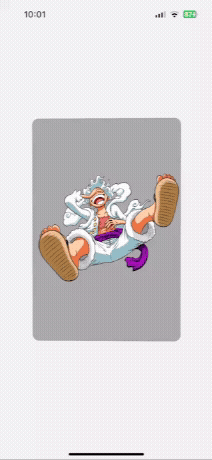
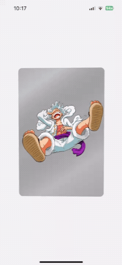
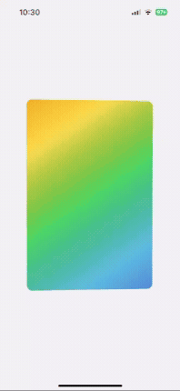
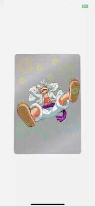
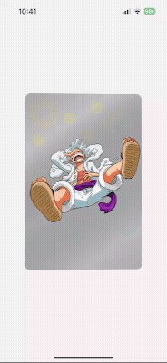

# 🃏 TiltHologramCard

A React Native component that creates stunning holographic card effects using device gyroscope sensors. Inspired by the famous [Pokémon card interaction website](https://poke-holo.simey.me/) and [React Native Shader Card](https://github.com/jerinjohnk/RNShaderCard), this project brings real-time 3D tilt and hologram effects to mobile apps.

## ✨ Features

- 🎯 **Gyroscope-based 3D tilt effects** - Real-time device motion detection
- 💎 **Dynamic hologram patterns** - Rainbow gradients with custom mask support
- ✨ **Light reflection effects** - Realistic light movement across card surface
- 🎮 **Smooth 60fps animations** - Optimized performance with React Native Reanimated
- 📱 **Cross-platform support** - Works on both iOS and Android

## 🎬 Demo

### Step 1: Basic 3D Tilt Effect


*Device gyroscope controls card rotation in 3D space*

### Step 2: Light Reflection


*Dynamic light gradients move with card orientation*

### Step 3: Hologram Background


*Rainbow gradient overlay creates holographic base effect*

### Step 4: Pattern Masking


*Custom hologram pattern applied through image masking*

### Step 5: Final Result


*Complete hologram effect that responds to light and tilt*

## 🚀 Quick Start

### Prerequisites

- Node.js 18+
- Expo CLI
- iOS/Android development environment

### Installation

```bash
# Clone the repository
git clone https://github.com/your-username/TiltHologramCard.git
cd TiltHologramCard

# Install dependencies
npm install

# Start the development server
npx expo start
```

### Android Setup

For smooth 60fps animations on Android, add the high sampling rate permission:

```json
// app.json
{
  "expo": {
    "android": {
      "permissions": ["android.permission.HIGH_SAMPLING_RATE_SENSORS"]
    }
  }
}
```

## 🛠️ Technical Implementation

### Core Technologies

- **[React Native Reanimated](https://docs.swmansion.com/react-native-reanimated/)** - Smooth 60fps animations
- **[Expo Sensors](https://docs.expo.dev/versions/latest/sdk/gyroscope/)** - Gyroscope data access
- **[React Native Skia](https://shopify.github.io/react-native-skia/)** - High-performance graphics rendering

### How It Works

1. **Gyroscope Integration**: Device motion data converted to rotation angles
   ```tsx
   rotateX.value = clamp(
     rotateX.value + (gyroscopeData.x / 2) * dt * RAD2DEG,
     -maxAngle, maxAngle
   );
   ```

2. **3D Transforms**: Perspective and rotation applied to card container
   ```tsx
   transform: [
     { perspective: 500 },
     { rotateX: `${rotateX.value}deg` },
     { rotateY: `${rotateY.value}deg` }
   ]
   ```

3. **Dynamic Gradients**: Light effects calculated based on tilt angles
   ```tsx
   const gradientStart = useDerivedValue(() => ({
     x: -width + (width/2 + (width/2) * (rotateY.value/maxAngle)),
     y: -height + (height/2 + (height/2) * (rotateX.value/maxAngle))
   }));
   ```

4. **Hologram Masking**: Luminance-based masking for realistic effects
   ```tsx
   <Mask mode="luminance" mask={lightGradient}>
     <Image image={hologramPattern} />
     <RainbowGradient />
   </Mask>
   ```


## 🙏 Acknowledgments

- Inspired by [Pokémon card interaction website](https://poke-holo.simey.me/) for the original holographic card concept
- Heavily based on [React Native Shader Card](https://github.com/jerinjohnk/RNShaderCard) - the main technical foundation for this implementation
- [Gyroscope hologram UI tweet](https://x.com/luciascarlet/status/1930614317541474598?s=46) for gyroscope-based interaction inspiration

---

**Bring your cards to life with realistic holographic effects! 🌈✨**
